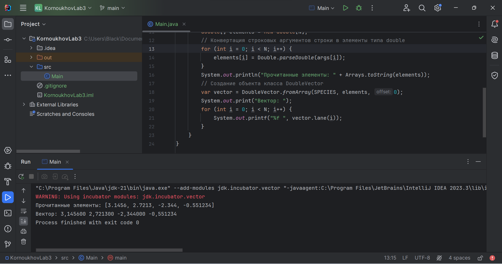

# Лабораторная работа №3
По дисциплине "Объектно-ориентированное программирование".

Выполнил студент группы ПИН-222 Корноухов Роман.

**Вариант 12.** Программа получает N параметров вызова (аргументы командной строки). Эти параметры – элементы вектора. Строится массив типа double, а на базе этого массива – объект класса DoubleVector. Далее программа выводит в консоль значения элементов вектора в виде: Вектор: 2.3 5.0 7.3.

